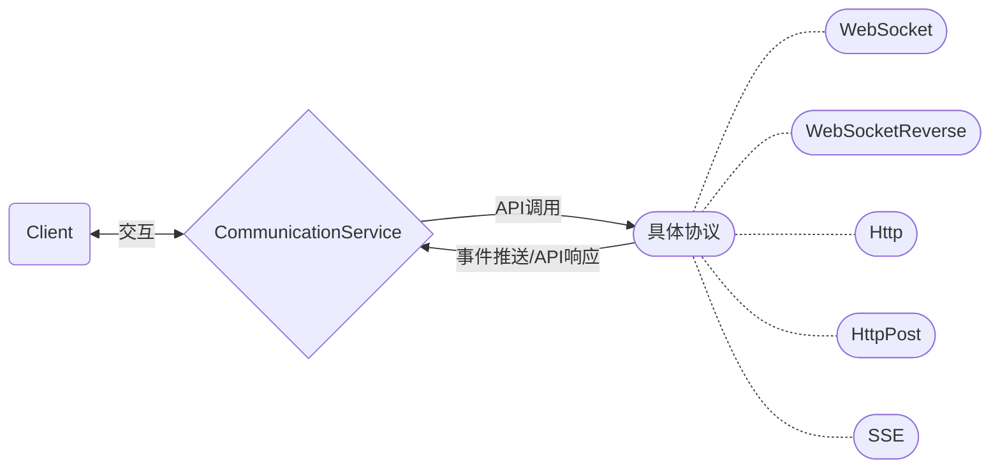
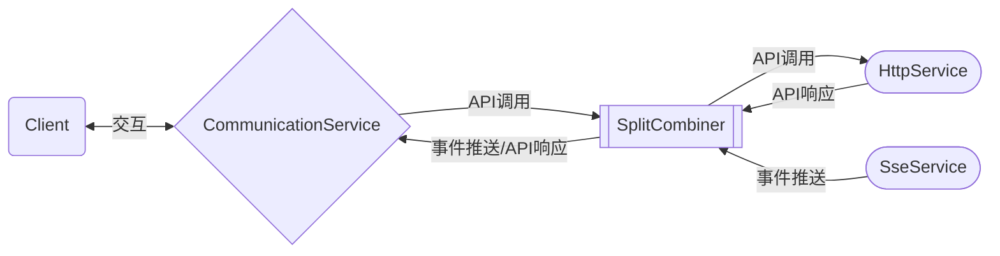
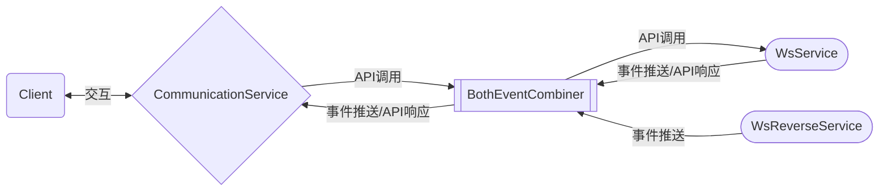
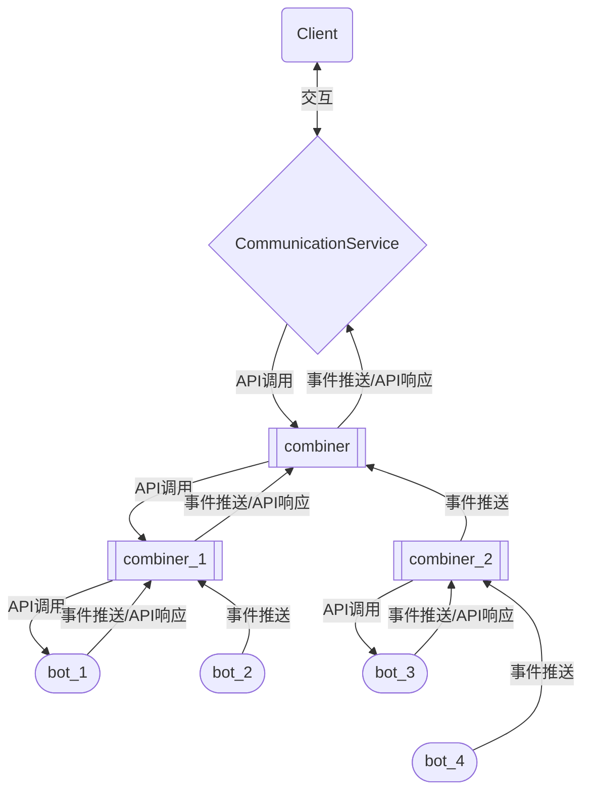

# Onebot API

库如其名，这是一个Onebot V11协议的实现  
目前已完成对Onebot V11协议所有API的实现

# 核心概念
## `Client`
`Client` 是高层客户端的入口，封装了API调用、事件推送等核心逻辑  
`Client` 通过 **依赖注入** 将 API调用、事件推送等逻辑层服务 与 具体协议 进行了解耦  
因此，`Client` 提供了 **协议无关** 的API接口和事件推送服务  
用户使用 `Client` 时无需关心底层连接是使用 正向WebSocket 还是 反向WebSocket 还是 其他协议  
同时，`Client` 还提供了运行时态更换底层协议的能力

## `CommunicationService`
`CommunicationService` 是 `Client` 与底层协议交互的基础  
任意实现了 `CommunicationService` 特征 的结构都可作为与 `Client` 交互的服务  

---
目前已实现的协议：
- 正向 WebSocket
- 反向 WebSocket
- SSE
- Http
- Http Post


# Usage

## Client用法

```rust
use std::time::Duration;
use onebot_api::api::APISender;
use onebot_api::communication::utils::{Client, Event};
use onebot_api::communication::ws::WsService;
use onebot_api::event::EventReceiver;
use onebot_api::text;

#[tokio::main]
async fn main() {
    let ws_service = WsService::new("wss://example.com", Some("example_token".to_string())).unwrap();
    let client = Client::new(ws_service, Some(Duration::from_secs(5)), None, None);
    client.start_service().await.unwrap();
    
    let msg_id = client.send_private_msg(123456, text!("this is a {}", "message"), None).await.unwrap();
    client.send_like(123456, Some(10)).await.unwrap();
    
    let mut event_receiver = client.get_receiver();
    while let Ok(event) = event_receiver.recv().await && let Event::Event(event) = &*event {
        println!("{:#?}", event)
    }
}
```

## 正向WebSocket

```rust
use std::time::Duration;
use onebot_api::communication::utils::Client;
use onebot_api::communication::ws::WsService;

#[tokio::main]
async fn main() {
    let ws_service = WsService::new("wss://example.com", Some("example_token".to_string())).unwrap();
    let client = Client::new(ws_service, Some(Duration::from_secs(5)), None, None);
    client.start_service().await.unwrap();
}
```

## 反向WebSocket

```rust
use onebot_api::communication::utils::Client;
use onebot_api::communication::ws_reverse::WsReverseService;
use std::time::Duration;

#[tokio::main]
async fn main() {
    let ws_reverse_service = WsReverseService::new("0.0.0.0:8080", Some("example_token".to_string()));
    let client = Client::new(ws_reverse_service, Some(Duration::from_secs(5)), None, None);
    client.start_service().await.unwrap();
}
```

## Http

```rust
use onebot_api::communication::utils::Client;
use std::time::Duration;
use onebot_api::communication::http::HttpService;

#[tokio::main]
async fn main() {
    let http_service = HttpService::new("https://example.com", Some("example_token".to_string())).unwrap();
    let client = Client::new(http_service, Some(Duration::from_secs(5)), None, None);
    client.start_service().await.unwrap();
}
```

## Http Post

```rust
use onebot_api::communication::utils::Client;
use std::time::Duration;
use onebot_api::communication::http_post::HttpPostService;

#[tokio::main]
async fn main() {
    let http_post_service = HttpPostService::new("0.0.0.0:8080", None, Some("example_secret".to_string())).unwrap();
    let client = Client::new(http_post_service, Some(Duration::from_secs(5)), None, None);
    client.start_service().await.unwrap();
}
```

## SSE

```rust
use onebot_api::communication::utils::Client;
use std::time::Duration;
use onebot_api::communication::sse::SseService;

#[tokio::main]
async fn main() {
    let sse_service = SseService::new("https://example.com/_events", Some("example_token".to_string())).unwrap();
    let client = Client::new(sse_service, Some(Duration::from_secs(5)), None, None);
    client.start_service().await.unwrap();
}
```

## 组合器
同时，该库设计了组合器来将不同的底层连接放在同一个Client上  
例如，你可以创建一个SseService和一个HttpService，同时通过组合器将它们放在同一个Client上  
其行为与直接用WsService并无差别

### `SplitCombiner`
将事件接收与API发送分为两个不同服务实现  
服务分为 `send_side` 与 `read_side`  
其中，`send_side` 负责API发送服务，`read_side` 负责事件接收服务  
`send_side` 的事件通道由一个 processor task 负责  
processor 将 `send_side` 的API响应事件并入原事件通道，其余事件丢弃
```rust
use onebot_api::communication::utils::Client;
use std::time::Duration;
use onebot_api::communication::combiner::SplitCombiner;
use onebot_api::communication::http::HttpService;
use onebot_api::communication::sse::SseService;

#[tokio::main]
async fn main() {
    let sse_service = SseService::new("https://example.com/_events", Some("example_token".to_string())).unwrap();
    let http_service = HttpService::new("https://example.com", Some("example_token".to_string())).unwrap();
    let combiner = SplitCombiner::new(http_service, sse_service);
    let client = Client::new(combiner, Some(Duration::from_secs(5)), None, None);
    client.start_service().await.unwrap();
}
```



#### TIPS
传统的 WebSocket 并不支持 HTTP 3，但是 SSE 支持 HTTP 3  
因此，最初设计 `SplitCombiner` 时，就是用来组合 `HttpService` 和 `SseService`  
这样既可以享受 HTTP 3 带来的优势，同时在使用体验上也不输 WebSocket

### `BothEventCombiner`
详见 `SplitCombiner`  
与 `SplitCombiner` 的区别在于  
`BothEventCombiner` 会将 `send_side` 的所有事件均并入原事件通道  
因此，`BothEventCombiner` 不存在 processor task
```rust
use onebot_api::communication::combiner::BothEventCombiner;
use onebot_api::communication::ws_reverse::WsReverseService;
use onebot_api::communication::utils::Client;
use onebot_api::communication::ws::WsService;
use std::time::Duration;

#[tokio::main]
async fn main() {
    let ws_service = WsService::new("wss://example.com", Some("example_token".to_string())).unwrap();
    let ws_reverse_service = WsReverseService::new("0.0.0.0:8080", Some("example_token".to_string()));
    let combiner = BothEventCombiner::new(ws_service, ws_reverse_service);
    let client = Client::new(combiner, Some(Duration::from_secs(5)), None, None);
    client.start_service().await.unwrap();
}
```



### TIPS
对于组合器，组合器与组合器之间也是可以被组合器所连接的  
因此，对于一个bot消息集群，可以通过多个 `BothEventCombiner` 来实现同一个client接收所有消息
```rust
use std::time::Duration;
use onebot_api::communication::combiner::BothEventCombiner;
use onebot_api::communication::http_post::HttpPostService;
use onebot_api::communication::sse::SseService;
use onebot_api::communication::utils::Client;
use onebot_api::communication::ws::WsService;
use onebot_api::communication::ws_reverse::WsReverseService;

#[tokio::main]
async fn main() {
    let bot_1 = WsService::new("ws://127.0.0.1:5000", None).unwrap();
    let bot_2 = WsReverseService::new("127.0.0.1:6000", None);
    let bot_3 = SseService::new("http://127.0.0.1:7000", None).unwrap();
    let bot_4 = HttpPostService::new("127.0.0.1:8000", None, None).unwrap();
    
    let combiner_1 = BothEventCombiner::new(bot_1, bot_2);
    let combiner_2 = BothEventCombiner::new(bot_3, bot_4);
    
    let combiner = BothEventCombiner::new(combiner_1, combiner_2);
    
    let client = Client::new(combiner, Some(Duration::from_secs(5)), None, None);
    client.start_service().await.unwrap();
}
```



### 何时使用哪种组合器？
- 使用 `SplitCombiner`：当你明确分离 **发送** 和 **接收** 时（例如刚才提到的 `SseService` 和 `HttpService`）
- 使用 `BothEventCombiner`：当你需要聚合多个独立bot实例的事件流

## `SegmentBuilder`
Onebot V11协议中，在发送消息时需要构造Segment Array  
库提供了所有Send Segment的类型，但手动构造它们还是太麻烦了  
于是就有了 `SegmentBuilder`
```rust
use std::time::Duration;
use onebot_api::api::APISender;
use onebot_api::communication::utils::Client;
use onebot_api::communication::ws::WsService;
use onebot_api::message::SegmentBuilder;

#[tokio::main]
async fn main() {
    let client = Client::new(WsService::new("ws://localhost:8080", None).unwrap(), Some(Duration::from_secs(5)), None, None);
    client.start_service().await.unwrap();
    
    let segment = SegmentBuilder::new()
        .text("this is an apple")
        .image("https://example.com/apple.png")
        .text("\n")
        .text("this is a banana")
        .image("https://example.com/banana.png")
        .build();
    
    client.send_private_msg(123456, segment, None).await.unwrap();
}
```
当然，`image` 中的选项很多，如果你希望的话，库也提供了部分 `segment` 的 `builder`
```rust
use onebot_api::message::SegmentBuilder;

#[tokio::main]
async fn main() {
    let segment = SegmentBuilder::new()
        .text("this")
        .image_builder("https://example.com/apple.png")
            .cache(true)
            .timeout(5)
            .proxy(true)
            .build()
        .text("is an apple")
        .build();
}
```
当然，bot发送消息大部分情况都只是文本  
每次都要创建 `SegmentBuilder` 还是太麻烦了  
于是就有了 `text` 宏
```rust
use std::time::Duration;
use onebot_api::api::APISender;
use onebot_api::communication::utils::Client;
use onebot_api::communication::ws::WsService;
use onebot_api::text;

#[tokio::main]
async fn main() {
    let client = Client::new(WsService::new("ws://localhost:8080", None).unwrap(), Some(Duration::from_secs(5)), None, None);
    client.start_service().await.unwrap();
    
    let msg = "123456".to_string();
    client.send_private_msg(123456, text!("this is a message: {}", msg), None).await.unwrap();
}
```
在 `text` 宏的内部使用了 `format` 宏  
因此，你可以像使用 `println` 宏一样使用 `text` 宏
